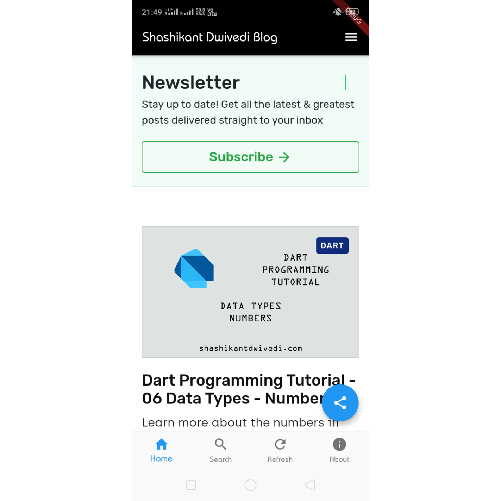

<!-- PROJECT SHIELDS -->

 


<!-- PROJECT LOGO -->
<br />

<p align="center">
  <a href="#">
    
  </a>


  <h3 align="center">Shashikant Dwivedi Blog App</h3>

  <p align="center">
    An flutter application for my personal blog
    <br />
  </p>

</p>


<!-- TABLE OF CONTENTS -->

## Table of Contents

* [About the Project](#about-the-project)
  * [Built With](#built-with)
* [Getting Started](#getting-started)
  * [Prerequisites](#prerequisites)
  * [Installation](#installation)
* [License](#license)
* [Contact](#contact)
* [Acknowledgements](#acknowledgements)


<!-- ABOUT THE PROJECT -->

## About The Project



I made this flutter application to use personal blog https://shashikantdwivedi.com/ comfortably in my android device. This flutter application is very easy to use. You can also use the application to convert your own blog into an android application.

You can easily navigate through pages and you can also share your share your articles from the application directly.  

### Built With

* [Dart Programming Language](https://dart.dev)
* [Flutter Framework](https://flutter.dev)


<!-- GETTING STARTED -->

## Getting Started

To run this flutter application on your device follow the steps given below.

### Prerequisites

To run this application on your device you must have flutter installed. Since this application is made with the stable version, I will also recommend you to go with the stable version of flutter.

Follow this guide to install flutter.

https://flutter.dev/docs/get-started/install

### Installation

1. Clone the repo

```sh
git clone https://github.com/shashikantdwivedi/skdblog.git
```
2. Run the application

```sh
flutter run -d <device-name>
```
<!-- LICENSE -->
## License

Distributed under the MIT License. See `LICENSE` for more information.


<!-- CONTACT -->
## Contact

Name - Shashikant Dwivedi

Email - shashikant@shashikantdwivedi.com

Follow - 

+ [Twitter]([@theskd1999](https://twitter.com/theskd1999))
+ [Instagram](https://www.instagram.com/dwivedikantshashi/)
+ [LinkedIn](https://www.linkedin.com/in/shashikant-dwivedi-6133591a1/)

Project Link: [https://github.com/shashikantdwivedi/skdblog](https://github.com/shashikantdwivedi/skdblog)


<!-- ACKNOWLEDGEMENTS -->
## Acknowledgements
* [WebView Flutter](https://pub.dev/packages/webview_flutter)
* [Firebase Messaging](https://pub.dev/packages/firebase_messaging)
* [Flutter Share](https://pub.dev/packages/flutter_share)
* [Provider](https://pub.dev/packages/provider)
* [Data Connection Checker](https://pub.dev/packages/data_connection_checker)


